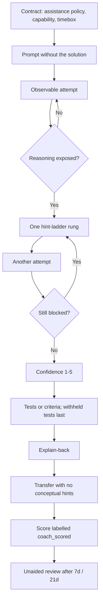
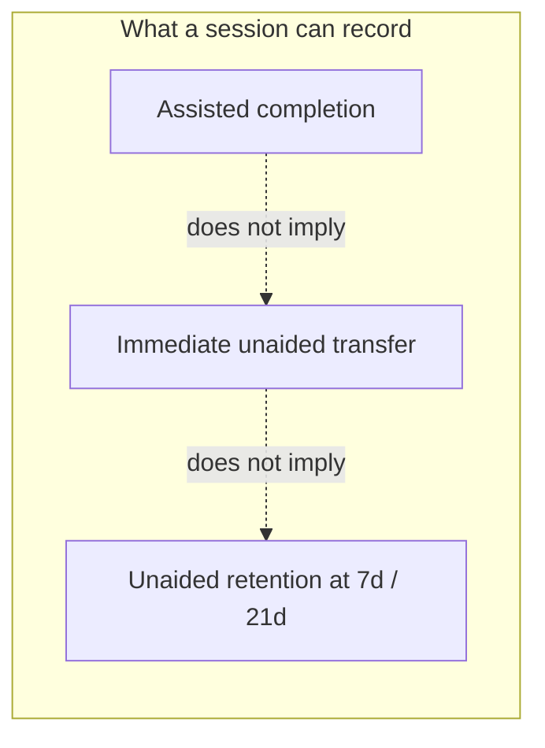

# Kata

A coaching skill that asks you to attempt the reasoning before it helps. It releases hints one rung at a time, asks for confidence before revealing correctness, and re-tests the concept on a changed surface once the hints are gone. Katas here are engineering reasoning — debugging, invariants, design — not puzzle drills.

Assisted completion and learning are different things. See [references/evidence.md](references/evidence.md) for the studies behind that premise, including their populations and limits.

This package is a practice protocol and an optional diary. It is not a psychometric instrument and not a controlled evaluation.

Compatible with Claude Code and Codex.

## Why the name

A [code kata](http://codekata.com/) is a short exercise you repeat yourself so the skill sticks — the programming analogue of a martial-arts form. Dave Thomas brought the term into software for deliberate practice, not for shipping a feature. This skill uses that meaning: you attempt the reasoning; the coach withholds the solution. The name is also vendor-neutral. It does not train a model, and it is not a Claude or GPT product. These katas target engineering reasoning (debugging, invariants, design), not puzzle drills.

## How a session works

The coach does not implement the core answer. It waits for an observable attempt, releases one hint rung at a time, asks for confidence before revealing correctness, and then re-tests the same idea on a changed surface with hints removed. The detailed protocol is in [references/session-protocol.md](references/session-protocol.md). The studies behind each step, and the limits of those studies, are in [references/evidence.md](references/evidence.md).



This skill is **dedicated practice**. It is not a “learn while the model ships the feature” mode. For ordinary implementation work, do not invoke it.

Assisted completion is not learning. A session can record three different outcomes; none of them implies the next:



## What it does not establish

- **No independent score.** Nothing here isolates an evaluator from the coaching context. Every score is `coach_scored`. `progress.py` refuses the `independent` evaluator label.
- **No validated measurement of the method.** A session demonstrates performance on that task. Trends from a single learner are not causal evidence.
- **No validated challenge bank.** Tasks are generated per session, so difficulty is not equated across attempts.
- **No official FSRS scheduling.** The log uses a local interval heuristic with arbitrary growth constants. Only unaided sessions update stability.
- **No security sandbox.** The runner uses a temp directory and a timeout. It does not block network or filesystem access.

The multiweek evaluation protocol and the four-role separation live in [references/deferred/](references/deferred/) as design input, not as procedures to run. [AUDIT.md](AUDIT.md) records the reviews that led to that demotion.

## Layout

| Path | Contents |
|---|---|
| `SKILL.md` | Canonical skill: contract, capability targets, modes, hint ladder, leakage rules |
| `skills/kata/` | Codex skill layout; symlinks to the canonical `SKILL.md`, `references/`, `scripts/`, `assets/`, and `agents/openai.yaml` |
| `.claude-plugin/plugin.json` | Claude Code plugin manifest |
| `.claude-plugin/marketplace.json` | Claude Code marketplace catalog for this repository |
| `.codex-plugin/plugin.json` | Codex / ChatGPT plugin manifest |
| `.agents/plugins/marketplace.json` | Codex marketplace catalog for this repository |
| `references/` | Protocols loaded on demand — session flow, rubric, assistance policies, challenge design, review |
| `references/deferred/` | Drafted protocols that are backlog, not current capability |
| `scripts/runner.py` | Deterministic test runner for Python, TypeScript, Java, Kotlin |
| `scripts/progress.py` | Optional practice log with a local interval heuristic |
| `agents/openai.yaml` | Interface metadata; implicit invocation is off |
| `tests/` | Test suite for both scripts |

## Use

### Plugin

This repository is both the plugin and a one-plugin marketplace.

Claude Code, local session:

```bash
claude --plugin-dir .
```

Claude Code, from GitHub:

```text
/plugin marketplace add andersonmalves/kata
/plugin install kata@kata
```

After a plugin install, invoke `/kata:kata` (plugin namespace plus skill folder).

Codex, from GitHub:

```bash
codex plugin marketplace add andersonmalves/kata
```

Then install **Kata** from that marketplace in the Codex / ChatGPT plugin UI.

### Standalone skill

Install as `kata`. Claude Code discovers skills placed in `~/.claude/skills/kata/` (personal) or `.claude/skills/kata/` (project), with `SKILL.md` at the root of that directory. Codex uses the interface metadata in `agents/openai.yaml`. Invoke with `/kata` or “me passa um kata”.

### Runner

```bash
python3 scripts/runner.py doctor
python3 scripts/runner.py run --language python --solution solution.py --tests challenge_test.py
```

Python is always available. Java, TypeScript, and Kotlin run only when `javac`/`java`, `tsc`/`node`, or `kotlinc`/`java` are on `PATH`. CI exercises the Python path. See [references/runner.md](references/runner.md).

### Progress log

The skill never creates the file on its own. Store metadata only — no solutions, no proprietary code.

```bash
python3 scripts/progress.py init --state .coding-reasoning/progress.json

python3 scripts/progress.py record --state .coding-reasoning/progress.json \
  --date 2026-01-01 --concept-id payment-idempotency-race --topic "payment idempotency" \
  --exercise "race in idempotency guard" --mode debug \
  --capability invariants_failures --phase practice \
  --assistance coached --evaluator coach \
  --initial-result incorrect --confidence 4 --outcome lightly_assisted \
  --hints 2 --explain-back 3 --transfer 2 --minutes 28

python3 scripts/progress.py record --state .coding-reasoning/progress.json \
  --date 2026-01-08 --concept-id payment-idempotency-race \
  --topic "payment idempotency" --exercise "redelivery of the same key" \
  --mode debug --capability invariants_failures --phase retention_7d \
  --assistance standard_unaided --evaluator coach \
  --initial-result correct --confidence 3 --outcome independent \
  --hints 0 --explain-back 3 --minutes 20

python3 scripts/progress.py review --state .coding-reasoning/progress.json \
  --concept-id payment-idempotency-race --recall good --confidence 3 \
  --on 2026-01-08

python3 scripts/progress.py due --state .coding-reasoning/progress.json
python3 scripts/progress.py status --state .coding-reasoning/progress.json
```

`record` refuses internally inconsistent sessions, including:

- hint level outside the outcome band in [references/rubric.md](references/rubric.md)
- `independent` after a wrong first answer, or after any conceptual hint
- a correct first answer recorded as `heavily_assisted` or `walked_through`
- conceptual hints under an unaided policy
- a coached policy on an unaided phase (`baseline`, `retention_*`, `final`)
- `conventional_ai` scored as `independent`, or with an unaided transfer score
- `retention_7d` / `retention_21d` without a prior session for that concept, or recorded before the 7/21-day gap
- the `independent` evaluator label

Assisted sessions may create a concept card due in 7 days; they do not update stability. `review` requires a recorded unaided session for that concept. See [references/adaptive-review.md](references/adaptive-review.md).

`status` separates unaided from assisted sessions and reports medians, not a mastery percentage. Treat those numbers as a diary.

## Tests

Standard library only, no dependencies:

```bash
python3 -m unittest discover -s tests
```

Requires Python 3.9 or newer; verified on 3.9 and 3.14.

## References and related work

Guardrails and scoring language come from [references/evidence.md](references/evidence.md). That file maps each protocol piece to a citation and states what the citation does not cover.

Design sources, not efficacy evidence:

| Source | Borrowed | Not copied |
|---|---|---|
| [drill-me](https://github.com/timini/drill-me) | Confidence before feedback; local concept memory; delayed review | Official FSRS; quiz-only tutoring |
| [swe-interview-coach](https://github.com/kirilxd/swe-interview-coach) | Learner-owned solution file; local runner; rubric | Interview-only scope; Python-only runner |
| [Algo Sensei](https://github.com/karanb192/algo-sensei) | Hint ladder; withhold the solution | DSA as the core; no runner |
| [Learning output style](https://code.claude.com/docs/en/output-styles) | Adjacent product for shipping work | Not a mode of this skill |

## License

MIT — see [LICENSE](LICENSE).
