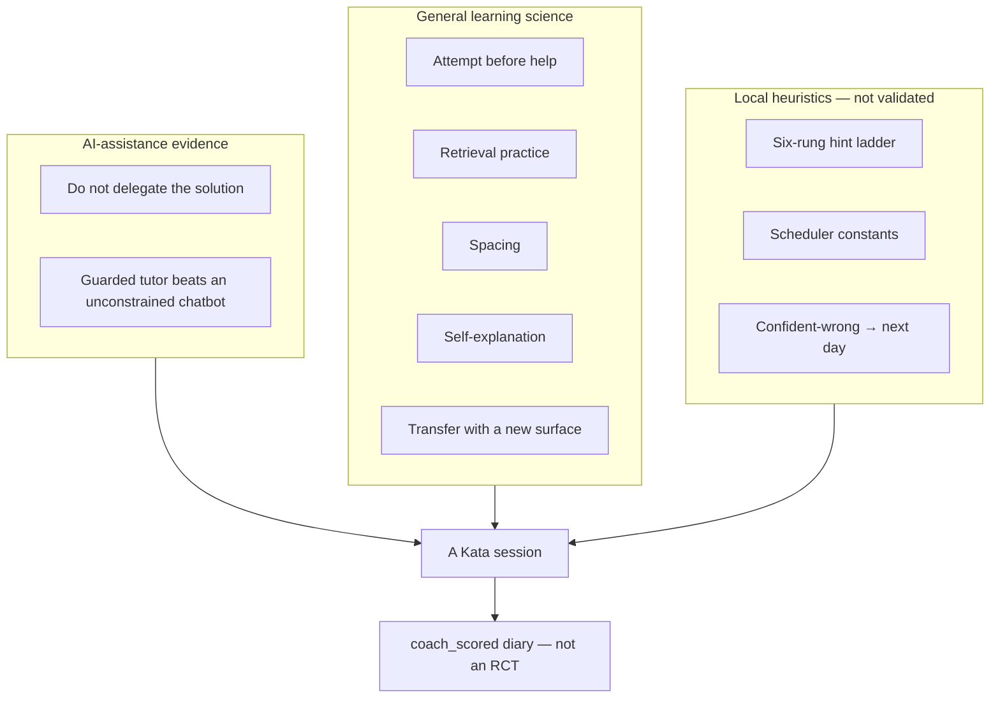

# Evidence and limits

Use these findings to justify the guardrails, not to overstate certainty. This skill has no trial of its own. Components are drawn from research on AI assistance and from general learning science. Those literatures are not studies of senior engineers using this protocol.

## What the AI-assistance evidence supports

- A randomized study of 52 **mostly junior** software engineers learning an unfamiliar Python library (Trio) found lower conceptual, code-reading, and debugging quiz performance for the AI-assisted group (50% vs 67%, Cohen's *d* = 0.738, *p* = 0.010), without a statistically significant completion-time benefit. The quiz was **immediate**, not delayed retention. “17% lower” in secondary write-ups is 17 **percentage points** (67 → 50), not a 17% relative drop. Interaction patterns that asked conceptual questions or requested explanations with generated code scored higher (about 65–86%) than delegation-heavy patterns (about 24–39%); those subgroups were tiny and are not separate causal estimates. This is not a study of senior engineers doing production work. Sources: [Shen and Tamkin, arXiv:2601.20245](https://arxiv.org/abs/2601.20245); [Anthropic summary](https://www.anthropic.com/research/AI-assistance-coding-skills).
- A field experiment with nearly 1,000 high-school **mathematics** students found that unrestricted GPT improved assisted practice (about +48%) but reduced subsequent unassisted exam performance (about −17% vs never-AI); a tutor that withheld full solutions largely mitigated that harm, without beating the no-AI control on the unaided exam. This is evidence that interaction design matters. It is not a programming study and not a study of senior engineers. Source: [Bastani et al., PNAS, 2025](https://doi.org/10.1073/pnas.2422633122).
- A 2026 preprint meta-analysis of **23 studies / 27 effect sizes** reported a moderate positive effect of generative AI on **productivity** (Hedges' *g* = 0.33, 95% CI [0.09, 0.58], *I²* ≈ 99%) and a small, non-significant pooled effect on **programming learning** (*g* = 0.14, 95% CI [−0.18, 0.47], *p* = 0.389, *I²* = 86%). The learning subset is **10 studies / 11 effects**, students only (university and K-12). When exams were taken without AI, the learning effect was indistinguishable from zero and slightly negative (*g* = −0.06); large gains appeared only when AI was allowed during the test (*g* = 0.76). Productivity gains were large in laboratory settings and near zero in the enterprise and open-source subsets. Treat this as preliminary: it is a preprint. Source: [Maier et al., arXiv:2605.04779](https://arxiv.org/abs/2605.04779).

These results support separating assisted performance from unaided learning and constraining answer delivery. They do not prove that this skill prevents long-term skill decay, and they do not validate the protocol for senior engineers.

## What the learning-science evidence supports

These citations justify protocol pieces. They are mostly classroom or laboratory studies of memory, not professional programming.

| Protocol piece | What the source shows | Strength here | Source |
|---|---|---|---|
| Genuine attempt before help | Prequestioning/pretesting can improve later learning if feedback follows, including after a wrong attempt. Effects vary by task and assessment. | Moderate | [Pan and Carpenter, 2023](https://doi.org/10.1007/s10648-023-09814-5) |
| Retrieval without the answer | Practice testing rated high utility across ages and materials. A classroom review of 50 experiments (n = 5,374) found consistent benefits. | Strong for learning in general; not programming-specific | [Dunlosky et al., 2013](https://doi.org/10.1177/1529100612453266); [Agarwal, Nunes, and Blunt, 2021](https://doi.org/10.1007/s10648-021-09595-9) |
| Delayed unaided review | Spacing beats massing in verbal recall (839 assessments, 317 experiments, 184 articles). Optimal gap depends on how long you need to retain. Does not validate 7- and 21-day constants. | Strong for spacing; weak for this scheduler | [Cepeda et al., 2006](https://doi.org/10.1037/0033-2909.132.3.354) |
| Explain-back | Prompted self-explanation, *g* = 0.55 from 69 effects in 64 reports. Dunlosky rated self-explanation moderate utility. | Moderate | [Bisra et al., 2018](https://doi.org/10.1007/s10648-018-9434-x) |
| Transfer on a new surface | Test-enhanced learning can transfer (*d* = 0.40, 192 effects, 122 experiments, N = 10,382), more so with elaboration, application, or inference. Without those moderators, the intercept often vanishes. Renaming variables is not transfer. | Moderate | [Pan and Rickard, 2018](https://doi.org/10.1037/bul0000151) |
| Progressive hints | Step-based intelligent tutors ≈ human tutoring vs no tutoring (*d* ≈ 0.76 vs 0.79). Does **not** validate a six-rung ladder. | Moderate, indirect | [VanLehn, 2011](https://doi.org/10.1080/00461520.2011.611369) |
| Confidence before feedback | High-confidence errors are often corrected after feedback, but prior knowledge predicts correction better than confidence. Collecting confidence is diagnostic; “confident-wrong → tomorrow” is a local heuristic. | Weak to moderate | [Sitzman, Rhodes, and Tauber, 2014](https://doi.org/10.3758/s13421-013-0344-3) |
| Runner and withheld tests | Improve measurement integrity. They are not themselves a learning intervention. | Indirect | — |
| Local interval heuristic | Spacing and performance-based intervals are supported. The constants, 365-day cap, and mixing of knowledge types on one card are not. Do not call this FSRS. | Not established | — |
| This skill as a whole | No experiment of the packaged intervention. | Not established | — |

## How to speak about results

- Say “evidence suggests,” “this session demonstrated,” or “we do not yet know.”
- Do not claim that desirable difficulty, hints, transfer, or spaced review guarantee retention.
- Treat immediate transfer as stronger evidence than assisted completion, and delayed unaided review as stronger evidence than immediate transfer.
- Distinguish research populations and tasks from the learner's context.
- Do not cite comparative “benchmark scores” of this skill against other tools as evidence.

## Design sources

These tools informed the protocol. They are not efficacy evidence, and this package does not claim to out-perform them in a trial.

| Source | Borrowed | Left out |
|---|---|---|
| [drill-me](https://github.com/timini/drill-me) | Ask before explaining; confidence before correction; local Markdown/JSON memory; delayed review | Official FSRS; general-knowledge quiz as the main loop |
| [swe-interview-coach](https://github.com/kirilxd/swe-interview-coach) | Learner-owned solution file the coach must not edit; local tests; rubric | Interview-first scope; Python-only runner |
| [Algo Sensei](https://github.com/karanb192/algo-sensei) | Hint ladder; withhold the full solution | DSA-only practice; no runner or persistence |
| [Learning output style](https://code.claude.com/docs/en/output-styles) | Separate product: learner writes small high-leverage slices while shipping | Not a mode of this skill |
| [Tutor Skills](https://github.com/bevibing/tutor-skills) | Codebase-grounded exercises as an adjacent idea | Obsidian vault; multiple-choice mastery percentages |
| [AlgoLocal](https://github.com/zxypro1/algolocal) | Local execution as a lab pattern | “Generate the solution” affordance; algorithms-only app |

A GitHub project named `skill-issue` is a joke skill, not a trainer. Do not treat it as related work.

## References

- Agarwal, P. K., Nunes, L. D., & Blunt, J. R. (2021). Retrieval practice consistently benefits student learning: A systematic review of applied research in schools and classrooms. *Educational Psychology Review, 33*, 1409–1453. https://doi.org/10.1007/s10648-021-09595-9
- Bastani, H., Bastani, O., Sungu, A., Ge, H., Kabakcı, Ö., & Mariman, R. (2025). Generative AI without guardrails can harm learning: Evidence from high school mathematics. *Proceedings of the National Academy of Sciences, 122*(26), e2422633122. https://doi.org/10.1073/pnas.2422633122
- Bisra, K., Liu, Q., Nesbit, J. C., Salimi, F., & Winne, P. H. (2018). Inducing self-explanation: A meta-analysis. *Educational Psychology Review, 30*, 703–725. https://doi.org/10.1007/s10648-018-9434-x
- Cepeda, N. J., Pashler, H., Vul, E., Wixted, J. T., & Rohrer, D. (2006). Distributed practice in verbal recall tasks: A review and quantitative synthesis. *Psychological Bulletin, 132*(3), 354–380. https://doi.org/10.1037/0033-2909.132.3.354
- Dunlosky, J., Rawson, K. A., Marsh, E. J., Nathan, M. J., & Willingham, D. T. (2013). Improving students’ learning with effective learning techniques: Promising directions from cognitive and educational psychology. *Psychological Science in the Public Interest, 14*(1), 4–58. https://doi.org/10.1177/1529100612453266
- Maier, S., Gunzenhäuser, M., Schweisthal, J., Schneider, M., & Feuerriegel, S. (2026). A meta-analysis of the effect of generative AI on productivity and learning in programming. *arXiv:2605.04779*. https://arxiv.org/abs/2605.04779
- Pan, S. C., & Carpenter, S. K. (2023). Prequestioning and pretesting effects: A review of empirical research, theoretical perspectives, and implications for educational practice. *Educational Psychology Review, 35*, 97. https://doi.org/10.1007/s10648-023-09814-5
- Pan, S. C., & Rickard, T. C. (2018). Transfer of test-enhanced learning: Meta-analytic review and synthesis. *Psychological Bulletin, 144*(7), 710–756. https://doi.org/10.1037/bul0000151
- Shen, J. H., & Tamkin, A. (2026). How AI impacts skill formation. *arXiv:2601.20245*. https://arxiv.org/abs/2601.20245
- Sitzman, D. M., Rhodes, M. G., & Tauber, S. K. (2014). Prior knowledge is more predictive of error correction than subjective confidence. *Memory & Cognition, 42*, 84–96. https://doi.org/10.3758/s13421-013-0344-3
- VanLehn, K. (2011). The relative effectiveness of human tutoring, intelligent tutoring systems, and other tutoring systems. *Educational Psychologist, 46*(4), 197–221. https://doi.org/10.1080/00461520.2011.611369
